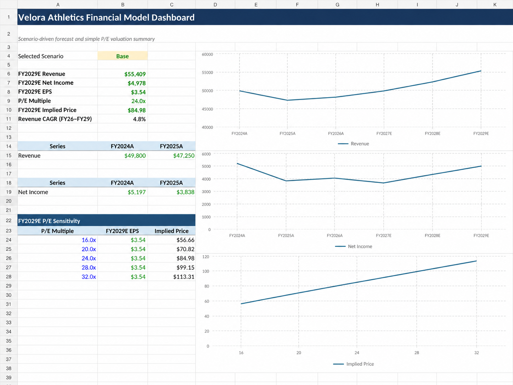
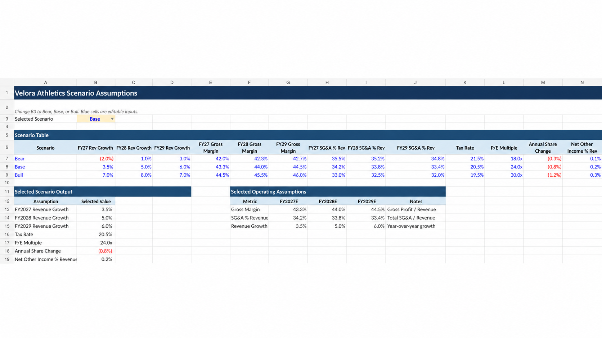
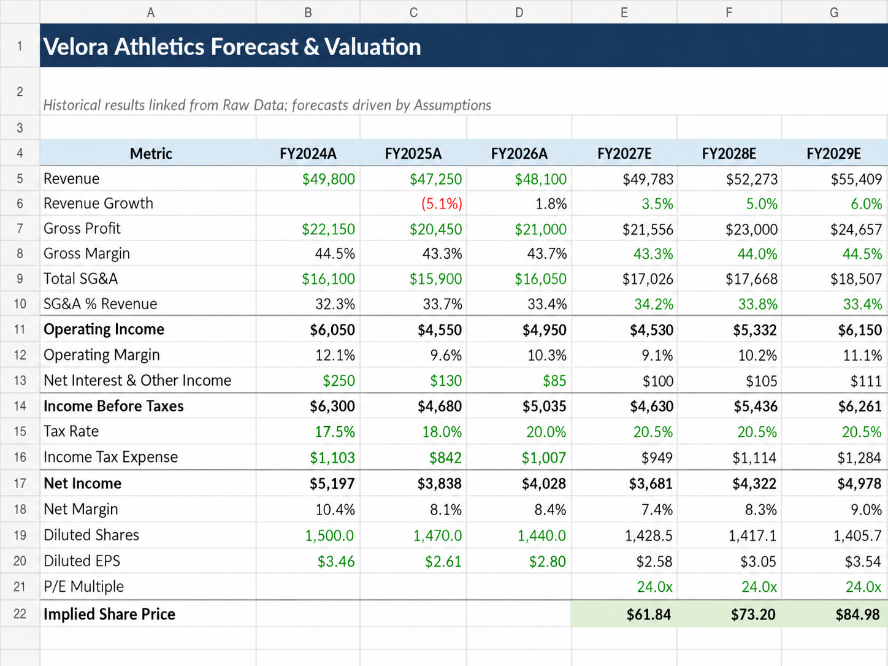

# Velora Athletics Financial Forecast & Valuation Model

An Excel-based financial modeling case study that builds a three-year forecast for **Velora Athletics** and estimates an implied share price using a P/E valuation approach.

> **Case-study note:** Velora Athletics is a fictional company. All historical figures and forecast assumptions in this project are synthetic and were created solely for educational and portfolio modeling purposes.



## Project Overview

The model converts FY2024–FY2026 historical case-study results into an assumption-driven forecast for FY2027–FY2029. A scenario selector switches between **Bear, Base, and Bull** cases and automatically updates forecast revenue, margins, earnings, EPS, and implied share price.

The project is designed to demonstrate practical Excel and finance skills without requiring a full three-statement or DCF model.

## What the Model Includes

- Historical financial analysis for FY2024–FY2026
- Bear, Base, and Bull scenario assumptions
- Revenue growth forecasting
- Gross margin forecasting
- SG&A as a percentage of revenue
- Operating income and operating margin analysis
- Simplified non-operating income assumptions
- Effective tax-rate forecasting
- Net income and net margin projections
- Diluted share-count forecasting
- Diluted EPS calculation
- P/E multiple valuation
- Implied share-price calculation
- P/E sensitivity analysis
- Excel dashboard with historical and forecast charts
- Formula guide for rebuilding and explaining the model

## Base-Case Illustration

Under the workbook's default **Base** scenario, the model produces approximately:

| Metric | FY2029E |
| --- | ---: |
| Revenue | $55.4 billion |
| Net Income | $5.0 billion |
| Diluted EPS | $3.54 |
| P/E Multiple | 24.0x |
| Implied Share Price | $84.98 |

These outputs are driven by synthetic model assumptions and are included only to demonstrate the mechanics of financial forecasting and valuation.

## Repository Files

| File | Description |
| --- | --- |
| `Velora_Athletics_Financial_Model.xlsx` | Completed model with assumptions, forecast, valuation, formula guide, dashboard, and charts |
| `Velora_Athletics_Raw_Data_Assumptions_Formula_Guide.xlsx` | Build-it-yourself version containing raw data, scenario assumptions, and formula guidance |
| `screenshots/dashboard.png` | Dashboard preview |
| `screenshots/assumptions.png` | Scenario assumptions preview |
| `screenshots/forecast-and-valuation.png` | Forecast and valuation preview |
| `screenshots/raw-data.png` | Historical data preview |
| `MODEL_NOTES.md` | Case-study methodology and modeling notes |

## Model Structure

### 1. Raw Data
Contains synthetic FY2024–FY2026 historical inputs used to establish revenue growth, profitability, effective tax rate, EPS, and share-count trends.

### 2. Assumptions
Contains the Bear, Base, and Bull cases. The selected scenario controls:

- Revenue growth
- Gross margin
- SG&A as a percentage of revenue
- Effective tax rate
- P/E multiple
- Annual diluted-share change
- Net interest and other income as a percentage of revenue



### 3. Forecast & Valuation
Links historical results from the Raw Data sheet and forecasts FY2027–FY2029 using the selected assumptions.

Key modeling relationships include:

```text
Forecast Revenue = Prior-Year Revenue × (1 + Revenue Growth)
Gross Profit = Revenue × Gross Margin
SG&A = Revenue × SG&A % of Revenue
Operating Income = Gross Profit − SG&A
Net Income = Income Before Taxes − Income Tax Expense
Diluted EPS = Net Income ÷ Diluted Shares
Implied Share Price = Diluted EPS × P/E Multiple
```



### 4. Dashboard
Summarizes the selected scenario, forecast revenue, net income, diluted EPS, P/E multiple, implied share price, revenue CAGR, and valuation sensitivity.

## Excel Skills Demonstrated

- Financial modeling
- Forecasting
- Scenario analysis
- Financial statement analysis
- Margin analysis
- Excel formulas and linked worksheets
- Data validation / scenario selection
- P/E valuation
- Sensitivity analysis
- Financial dashboard design

## How to Use the Model

1. Download `Velora_Athletics_Financial_Model.xlsx`.
2. Open the **Assumptions** sheet.
3. Change the scenario selector in cell **B3** between Bear, Base, and Bull.
4. Review the updated results in **Forecast & Valuation**.
5. Review the summarized output and charts in **Dashboard**.
6. Use the raw-data workbook if you want to rebuild the model independently.

## Purpose

This project was created for educational and portfolio purposes to demonstrate financial forecasting, Excel modeling, scenario analysis, and basic equity valuation skills.
